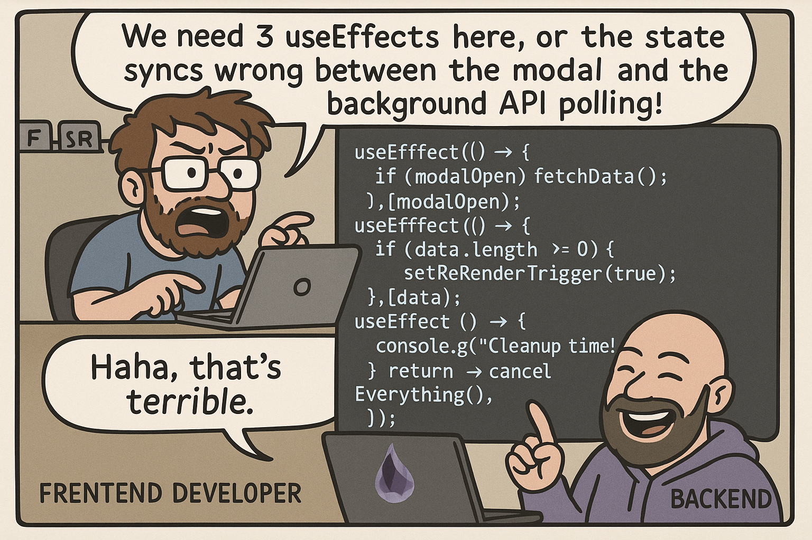

### Hi

I spend most of my time creating software in the northern parts of Sweden. My repositories are a playground of experiments where I explore new programming languages, tackle intriguing challenges, and build tools—including ones for the local dog club.

## Yearly update

## Alchemy4Elixir

Recently, I launched a project called Alchemy4Elixir.dev. It’s still in the experimental phase, but it’s live and open to anyone interested in solving a curated set of problems while learning Elixir. If you’re familiar with 4Clojure, you’ll recognize the approach I’m aiming for here.
